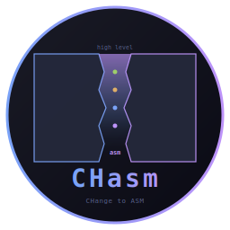
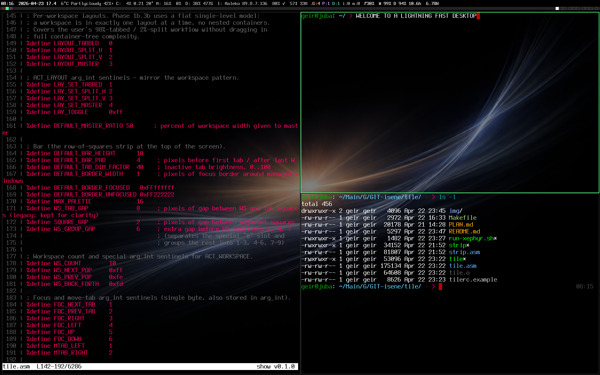

# CHasm — CHange to ASM



A small suite of Linux tools written entirely in **x86_64 assembly**.
No libc. No toolkits. No dynamic linking. No runtime. Just NASM source,
direct syscalls, and the X11 wire protocol.

Each tool is a single static ELF binary. None of them depend on each
other or on anything else outside the kernel and the X server.

The reason for releasing these tools into the Public Domain is not that you should use them. They are released for inspiration. Your use cases and preferences are different from mine. So instead of installing these and adopt your ways of working to these tools, you should rather: clone the repos, fire up Claude Code, prompt the changes you want and make the tools fit you.

<br clear="left"/>



Every binary on this screen is x86_64 assembly: **tile** holds the
layout, **strip** + the **asmites** (the per-segment programs in
[chasm-bits](https://github.com/isene/chasm-bits)) drive the status
row, **glass** renders each pane (pseudo-transparency picks up the
wallpaper), **bare** is the shell behind every prompt, and **show**
is rendering syntax-highlighted source in both the left and
bottom-right panes. No libc, no toolkit — the whole desktop talks
straight to the kernel and the X server.

## The tools

| Tool | Purpose | Lines | Binary |
|------|---------|-------|--------|
| **[bare](https://github.com/isene/bare)**   | Interactive shell with line editing, history, completion, nicks, multi-pipes, redirects, here-strings, abbreviations, undo, smart hotkeys | ~16k | ~150KB |
| **[show](https://github.com/isene/show)**   | Pager / file viewer with syntax highlighting, ESC sanitisation, cat/pane/pipe modes | ~3.5k | ~40KB |
| **[glass](https://github.com/isene/glass)** | Terminal emulator: X11 wire protocol, kitty graphics, color emoji via XRender, pseudo-transparency, configurable fonts/keys | ~12k | ~110KB |
| **[tile](https://github.com/isene/tile)**   | Tiling window manager: 10 workspaces, per-workspace tabs, row-of-squares bar with per-tab colour cycling, smart workspace cycling, stash | ~3.5k | ~37KB |
| **[glyph](https://github.com/isene/glyph)** | TrueType font rasterizer: TTF/OpenType parser, quadratic Bezier flatten, scanline NZW with 4x4 supersample AA, composite glyphs, UTF-8, variable fonts (fvar+gvar+IUP) | ~4.2k | ~37KB |

Stack them all together and you get a complete X session in **under
400 KB** of executable code, with zero shared libraries to update,
patch, or break.

## Why?

Modern software stacks are deep. A terminal emulator routinely loads
30+ shared libraries before drawing a single character. A shell pulls
in Python, GLib, OpenSSL transitively. Window managers depend on a
toolkit that depends on a compositor that depends on... CHasm strips
all of that away to find out what you actually *need*.

The answer turns out to be: surprisingly little. The Linux kernel gives
you syscalls. X11 is just a Unix socket and a documented wire protocol.
Everything else is a choice. CHasm is the choice to write everything
yourself, from scratch, in the smallest reasonable language.

## Shared aesthetic

Every CHasm tool follows the same conventions:

- **Pure x86_64 NASM**, no libc, no `int 0x80` (only `syscall`)
- **Single static ELF**, no dynamic linking, no `.so` dependencies
- **Build pattern**: `nasm -f elf64 file.asm -o file.o && ld file.o -o file`
- **All BSS**, no malloc — every buffer is statically allocated
- **Zero-waste rule**: features that aren't used pay no cost. Optional
  code paths are gated to be cold at rest.
- **Plain config files**: `~/.barerc`, `~/.glassrc`, `~/.tilerc` — line-
  based key=value, no JSON/TOML/YAML parsers needed
- **Unlicense** — public domain

## Build them all

```bash
for t in bare show glass tile glyph; do
  git clone https://github.com/isene/$t.git
  (cd $t && make)
done
```

Each `make` runs the same two-step build (nasm → ld). Total wall time
on a modern laptop: under 3 seconds for the entire suite.

## Configuration tools

The CHasm tools are paired with optional Rust TUI configurators that
make their config files easier to edit interactively:

- [bareconf](https://github.com/isene/bareconf)
- [glassconf](https://github.com/isene/glassconf)
- tileconf — coming after tile stabilises

These are the *only* CHasm-adjacent tools written in something other
than asm; they exist because writing a TUI configurator in pure asm
would defeat the whole point.

## Status

All five tools are usable today. tile is approaching "replace i3
entirely" feature parity. glyph is the newest — a pure-asm TTF
rasterizer that already renders OpenType variable fonts (interpolating
between weight masters via gvar deltas + IUP), with the eventual goal
of replacing glass's X core bitmap fonts so the whole desktop renders
TTF without dynamic linking. The next major addition is `strip` — an
X11 status bar with system tray, written in the same pure-asm style —
which will join the suite when tile lands its multi-monitor phase.

## License

[Unlicense](https://unlicense.org/) — public domain. Take it, fork it,
strip it for parts.
