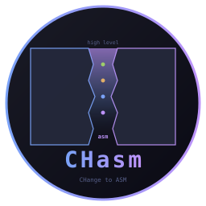

# CHasm: CHange to ASM



A small suite of Linux tools written entirely in **x86_64 assembly**.
No libc. No toolkits. No dynamic linking. No runtime. Just NASM source,
direct syscalls, the X11 wire protocol, and, since **frame**, DRM/KMS
and evdev straight to the hardware.

Each tool is a single static ELF binary. None of them depend on each
other or on anything else outside the kernel. The X server they talk to
is in here too.

**Landing page:** [isene.org/chasm](https://isene.org/chasm/)

The reason for releasing these tools into the Public Domain is not that you
should use them. They are released for inspiration. Your use cases and
preferences are different from mine.

So instead of installing these and adopt your ways of working to these
tools, you should rather: clone the repos, fire up Claude Code, prompt the
changes you want and make the tools fit you.

<br clear="left"/>


Every binary on this screen is x86_64 assembly: **tile** holds the
layout, **strip** + the **asmites** (the per-segment programs in
[chasm-bits](https://github.com/isene/chasm-bits)) drive the status
row, **glass** renders each pane (pseudo-transparency picks up the
wallpaper), **bare** is the shell behind every prompt, and **show**
is rendering syntax-highlighted source in both the left and
bottom-right panes.

No libc, no toolkit: the whole desktop talks straight to the kernel and
the X server. These days that server is **frame**, so the assembly now
reaches all the way down to DRM/KMS.

## The tools

| Tool | Purpose | Lines | Binary |
|------|---------|-------|--------|
| **[bare](https://github.com/isene/bare)**   | Interactive shell with line editing, history, completion, nicks, multi-pipes, redirects, here-strings, abbreviations, undo, smart hotkeys | ~20k | 175KB |
| **[show](https://github.com/isene/show)**   | Pager / file viewer with syntax highlighting, ESC sanitisation, cat/pane/pipe modes | ~3.9k | 45KB |
| **[glass](https://github.com/isene/glass)** | Terminal emulator: X11 wire protocol, kitty graphics, color emoji via XRender, pseudo-transparency, configurable fonts/keys | ~21k | 199KB |
| **[tile](https://github.com/isene/tile)**   | Tiling window manager: 10 workspaces, per-workspace tabs, row-of-squares bar, smart cycling, stash. Bundles **strip**, the X11 status bar that hosts the asmites (a further ~5.9k lines, 81KB) | ~14k | 133KB |
| **[frame](https://github.com/isene/frame)** | X11 display server: serves the wire protocol straight onto DRM/KMS and evdev: window tree, damage-driven compositor, RENDER, SHAPE, XKB, RandR, MIT-SHM, XInput2, XFIXES. Runs the whole CHasm desktop plus Firefox, GIMP and Discord, with no Xorg, no libdrm and no Mesa anywhere in the path | ~25k | 192KB |
| **[chasm-bits](https://github.com/isene/chasm-bits)** | "Asmites" fed into `strip`: clock, cpu, mem, disk, battery, brightness, network, mailbox, moonphase, wintitle, … each one a tiny static binary | ~2k  | ~5KB each |
| **[glyph](https://github.com/isene/glyph)** | TrueType font rasterizer: TTF/OpenType parser, quadratic Bezier flatten, scanline NZW with 4x4 supersample AA, composite glyphs, UTF-8, variable fonts (fvar+gvar+IUP) | ~5.7k | 47KB |
| **[bolt](https://github.com/isene/bolt)**   | Screen locker: fullscreen override-redirect, keyboard + pointer grab, baked raw-RGB lock-screen image, suid-root C helper for `crypt()`/shadow auth | ~3.2k | 29KB |
| **[spot](https://github.com/isene/spot)**   | Presenter tools, four modes from one binary: **spotlight** (dimmed snapshot, circular hole tracks the cursor), **draw** (click-drag annotation, colour + width configurable), **highlight** (drag-rect that stays bright on a dim surround), **ocr** (drag-rect text grab to clipboard, works on unselectable GUI text) | ~2.4k | 23KB |
| **[hyperlist-display](https://github.com/isene/hyperlist-display)** | Claude Code `MessageDisplay` hook: renders every answer as a tab-indented [HyperList](https://isene.org/hyperlist/), one idea per line, numbered by depth. Display-only, the transcript keeps the markdown. `/hl` toggles it. Replaced a 52 ms Python hook that fired per streamed chunk | ~4.8k | 50KB |

Stack them all together and you get a complete X session, display
server included, in **under 1 MB** of executable code, with zero
shared libraries to update, patch, or break.

What that costs at the battery, whole desktop up on frame, wifi on,
four idle Claude Code sessions open (Dell XPS 14, Core Ultra 7 255H,
measured 10 September 2026):

| Screen | Watts |
|--------|-------|
| at 60 % | 2.63 |
| blank | 1.64 |

The CHasm programs themselves add about 7 mW. The rest is the screen,
the chipset and the radios.

## Try it

Three commands, one desktop:

```bash
git clone https://github.com/isene/chasm
cd chasm
./chasm-install
```

`chasm-install` fetches the prebuilt static binaries from the
[latest release](https://github.com/isene/chasm/releases/latest) into
`/usr/local/bin`. The whole suite is a small download. It verifies the
release SHA-256 checksum before installing. It installs the
few fonts the suite reads and drops default config files into your home
(yours are kept if you have them).

It adds five wallpapers, bakes the first, and puts a **CHasm** entry in
your login screen's session list. It asks one question: whether to make
**bolt-greet** the login screen. Say no and nothing about your boot
changes.

Then log out and pick CHasm. Or, from a text console with the login
screen stopped, run `sudo chasm-session` to get the whole thing on
**frame**, the assembly X server, with no Xorg anywhere. Inside,
`Mod4+Return` opens a glass, `Mod4+?` shows every key, `Mod4+w` cycles
wallpapers, `Mod4+Escape` locks.

Debian, Ubuntu and Mint get their packages through `apt`; on other
distros install DejaVu fonts and ImageMagick yourself first.
`./chasm-install --build` builds the commits pinned in
[`sources.lock`](sources.lock) instead of downloading (needs nasm, ld,
gcc and libcrypt development files). Use `--version TAG` for a specific release and `--rollback` to
return to the previous bundle. See [support and release instructions](SUPPORT.md)
for local archives, troubleshooting and maintenance.

## The keys

The suite shares one keyboard scheme: plain **Mod4** is the desktop
(workspaces, tabs, spot, frame's toggles), **Mod4+Shift** acts on a
window or restarts a component, and **Alt** belongs to glass (unbound
Alt+keys pass through to terminal apps as Meta).

**Mod4+?** opens the key reference: tile's `keys` action paints every
combo on a full-screen overlay, in columns, one colour per group. The
text comes from [`chasm-keys`](chasm-keys), a builtins-only bash script
that reads `~/.tilerc`, `~/.framerc` and `~/.glassrc` on every open, so
a rebound key shows up the next time you look.

Type to search: matching rows light up, the rest fade. `Tab` flips
between what a key does and the command behind it. `Esc` closes. A
tile bind's description is the `# comment` on its line in `~/.tilerc`,
so a comment there is what the popup shows.

The same table in a terminal:

```bash
chasm-keys
```

## Why?

Modern software stacks are deep. A terminal emulator routinely loads
30+ shared libraries before drawing a single character. A shell pulls
in Python, GLib, OpenSSL transitively. Window managers depend on a
toolkit that depends on a compositor that depends on... CHasm strips
all of that away to find out what you actually *need*.

The answer turns out to be: surprisingly little. The Linux kernel gives
you syscalls. X11 is just a Unix socket and a documented wire protocol.
Everything else is a choice. CHasm is the choice to write everything
yourself, from scratch, in the smallest reasonable language.

## Shared aesthetic

Every CHasm tool follows the same conventions:

- **Pure x86_64 NASM**, no libc, no `int 0x80` (only `syscall`)
- **Single static ELF**, no dynamic linking, no `.so` dependencies
- **Build pattern**: `nasm -f elf64 file.asm -o file.o && ld file.o -o file`
- **All BSS**, no malloc: every buffer is statically allocated
- **Zero-waste rule**: features that aren't used pay no cost. Optional
  code paths are gated to be cold at rest.
- **Plain config files**: `~/.barerc`, `~/.glassrc`, `~/.tilerc`: line-
  based key=value, no JSON/TOML/YAML parsers needed
- **Unlicense**: public domain

## Build from source

```bash
./chasm-install --build
```

This builds and installs the eight core tools from the exact commits in
[`sources.lock`](sources.lock). It also checks out `glyph`, which `glass`
includes at build time. The bundle records source commits and tool versions.
The release tarball is made by [`chasm-release`](chasm-release) in this repo.
The standalone `glyph` binary and `hyperlist-display` are optional projects.

## Configuration tools

The CHasm tools are paired with optional Rust TUI configurators
([crust](https://github.com/isene/crust)-based) that make their config
files easier to edit interactively:

| Configurator | Edits | Status |
|--------------|-------|--------|
| [bareconf](https://github.com/isene/bareconf)   | `~/.barerc`  | shipped |
| [glassconf](https://github.com/isene/glassconf) | `~/.glassrc` | shipped |
| [tileconf](https://github.com/isene/tileconf)   | `~/.tilerc`  | shipped |
| [stripconf](https://github.com/isene/stripconf) | `~/.striprc` | shipped |

All four use the same `~/.<tool>rc.tmp → .bak → publish` atomic-save
dance, so a kill mid-write can never blank a config; `mv ~/.<tool>rc.bak
~/.<tool>rc` always restores the previous good state.

These are the *only* CHasm-adjacent tools written in something other
than asm; they exist because writing a TUI configurator in pure asm
would defeat the whole point.

## Status

The core desktop builds from the pinned sources above. For current feature
status and hardware limitations, see each component's own repository.

## License

[Unlicense](UNLICENSE): public domain. Take it, fork it,
strip it for parts.
